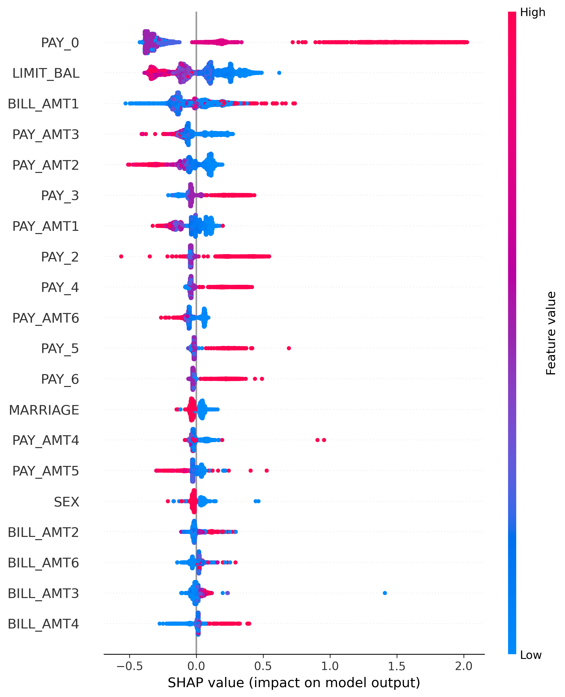
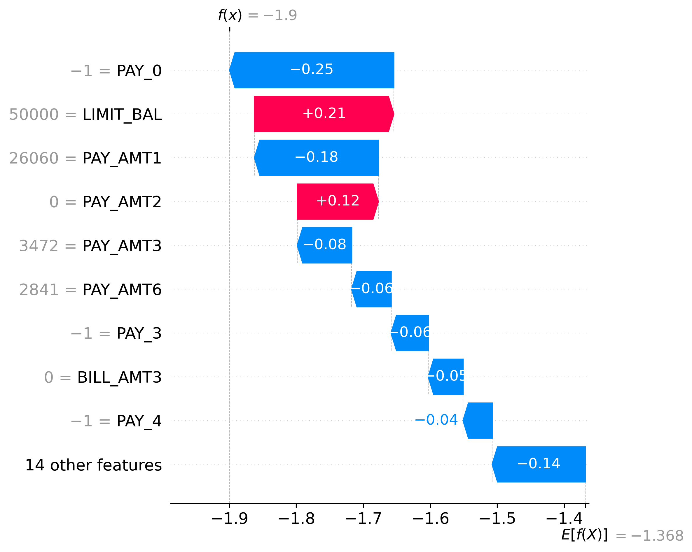

# Credit Risk Decision Engine

This project builds an end-to-end machine learning system to predict **credit default risk** and convert those predictions into **practical lending decisions**.

Instead of stopping at model accuracy, the goal was to simulate how a real credit risk system works. The system predicts the probability that a borrower will default and then applies decision rules to determine whether the loan should be:

- APPROVE
- REVIEW
- REJECT

The final model is also deployed through a **FastAPI API**, allowing the system to score applicants through a REST endpoint.

---

## Business Problem

Credit default prediction is not just a classification task. In lending, prediction errors have different financial consequences.

Two types of errors matter the most:

- **False Negative (FN)** - approving a borrower who later defaults
- **False Positive (FP)** - rejecting a borrower who would have repaid

Because these errors have asymmetric costs, the model should not be optimized only for accuracy. Instead, it should help minimize **expected financial loss**.

This project builds a system that:

- predicts probability of default
- compares multiple machine learning models
- calibrates predicted probabilities
- optimizes decision thresholds based on financial cost
- evaluates fairness across demographic groups
- exposes the scoring logic through an API

---

## Dataset

The project uses the **UCI Default of Credit Card Clients dataset**.

Dataset characteristics:

- Rows: **30,000**
- Target: **default payment next month**
- Feature types:
  - demographic information
  - credit limit
  - repayment history
  - bill amounts
  - payment amounts

Important variables include:

- `LIMIT_BAL`
- `SEX`
- `EDUCATION`
- `MARRIAGE`
- `AGE`
- `PAY_0` to `PAY_6`
- `BILL_AMT1` to `BILL_AMT6`
- `PAY_AMT1` to `PAY_AMT6`

These variables capture both **financial behavior and payment history**, which are strong predictors of credit risk.

---

## Project Workflow

### Data Preparation

The raw Excel dataset required several cleaning steps:

- fixing column header issues
- correcting invalid category codes in `EDUCATION` and `MARRIAGE`
- removing the identifier column (`ID`)
- saving a cleaned dataset for modeling

---

### Exploratory Data Analysis

EDA was used to understand patterns related to default risk.

Key analyses included:

- examining class imbalance
- analyzing default rate by demographic groups
- studying repayment history effects
- correlation heatmap of financial variables

Key observation:

- repayment status variables (`PAY_0`, `PAY_2`, etc.) strongly influence default risk.

---

### Models Trained

Three models were trained and compared:

- **Logistic Regression** (interpretable baseline)
- **Random Forest**
- **Gradient Boosting**

Model performance:

| Model | ROC-AUC |
|------|--------|
| Logistic Regression | 0.708 |
| Random Forest | 0.773 |
| Gradient Boosting | 0.778 |

Gradient Boosting achieved the best performance.

---

### Cost-Sensitive Decision Optimization

Instead of selecting a classification threshold arbitrarily, the project evaluates **expected financial loss**.

Assumed cost structure:

- False Negative cost: **$10,000**
- False Positive cost: **$1,000**

By sweeping probability thresholds, the system identified:

- Optimal threshold: **0.10**

This threshold minimized expected financial loss.

---

## Final Decision Policy

Predicted probabilities are converted into lending decisions.

| Probability of Default | Decision |
|------------------------|---------|
| p < 0.10 | APPROVE |
| 0.10 ≤ p < 0.30 | REVIEW |
| p ≥ 0.30 | REJECT |

Example API response:

```json
{
  "default_probability": 0.106943,
  "decision": "REVIEW",
  "thresholds": {
    "approve_below": 0.1,
    "review_below": 0.3,
    "reject_at_or_above": 0.3
  }
}
```

This mirrors how real lending systems combine **machine learning predictions with business rules**.

---

## Model Explainability

To understand model behavior, **SHAP (SHapley Additive Explanations)** was used.

Global explanations showed that **repayment history variables are the strongest predictors of default risk**.

Important features include:

- `PAY_0`
- `PAY_2`
- `PAY_3`
- `PAY_4`
- `LIMIT_BAL`
- `BILL_AMT1`
- `PAY_AMT1`

Explanation plots included in the project:

- SHAP summary plot (global feature importance)


- SHAP waterfall plot for an individual prediction


Saved figures:

```
outputs/figures/shap_summary.png
outputs/figures/shap_waterfall_applicant_0.png
```

---

## Fairness Analysis

A fairness audit was performed across demographic groups using the **SEX variable**.

Metrics evaluated:

- True Positive Rate (TPR)
- False Positive Rate (FPR)
- Selection Rate

Results showed **relatively similar behavior across groups**, with only modest differences.

---

## System Architecture

Project pipeline:

```
1. Dataset
2. Data Cleaning
3. Feature Engineering
4. Machine Learning Models (Logistic Regression / Random Forest / Gradient Boosting)
5. Probability Calibration
6. Decision Policy
7. FastAPI API
8. Prediction Endpoint

```

---

## API Deployment

The trained model is deployed using **FastAPI**.

Run the API locally:

```bash
python -m uvicorn app.main:app --reload
```

Open interactive documentation:

```
http://127.0.0.1:8000/docs
```

Available endpoints:

- `GET /` — health check
- `POST /predict` — credit scoring endpoint

The `/predict` endpoint returns:

- predicted default probability
- lending decision
- decision thresholds

---

## Project Structure

```
credit_risk_decision_engine/
│
├── app/
│   ├── __init__.py
│   └── main.py
│
├── data/
│   ├── raw/
│   └── processed/
│
├── models/
│   ├── final_credit_model.pkl
│   └── decision_config.pkl
│
├── notebooks/
│   ├── 01_data_understanding.ipynb
│   ├── 02_eda.ipynb
│   └── 03_modeling.ipynb
│
├── outputs/
│   ├── figures/
│   └── metrics/
│
├── reports/
│
├── requirements.txt
└── README.md
```

---

## Skills Demonstrated

This project demonstrates experience with:

- data cleaning and preprocessing
- exploratory data analysis
- classification modeling
- ensemble methods
- probability calibration
- cost-sensitive learning
- SHAP explainability
- fairness auditing
- FastAPI deployment
- decision-system design

---

## Possible Future Improvements

Potential extensions:

- benchmarking **XGBoost or LightGBM**
- adding a **SHAP explanation endpoint to the API**
- containerizing the system with **Docker**
- deploying the system to a **cloud environment**
- implementing **model monitoring and drift detection**

---

## Author

**Balla Moussa Diaite**  
MS in Data Science — NJIT